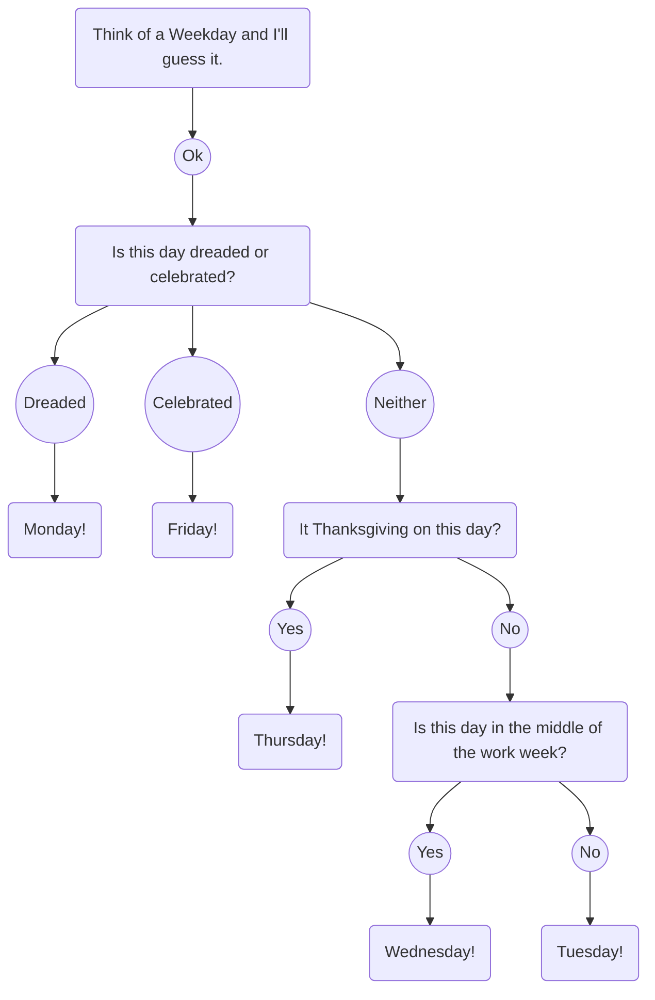

```mermaid
flowchart TD;
    id1(Think of a Weekday and I'll guess it.)
    id1(Think of a Weekday and I'll guess it.)-->id2((Ok))
    id2((Ok))-->id3(Is this day dreaded or celebrated?)
    id3(Is this day dreaded or celebrated?)-->id4((Dreaded))
    id3(Is this day dreaded or celebrated?)-->id5(Celebrated)
    id3(Is this day dreaded or celebrated?)-->id8((Neither))
    id4((Dreaded))-->id6(Monday!)
    id5((Celebrated))-->id7(Friday!)
    id8((Neither))-->id9(It Thanksgiving on this day?)
    id9(It Thanksgiving on this day?)-->id10((Yes))
    id9(It Thanksgiving on this day?)-->id11((No))
    id10((Yes))-->id12(Thursday!)
    id11((No))-->id13(Is this day in the middle of the work week?)
    id13(Is this day in the middle of the work week?)-->id14((Yes))
    id13(Is this day in the middle of the work week?)-->id15((No))
    id14((Yes))-->id16(Wednesday!)
    id15((No))-->id17(Tuesday!)
```
