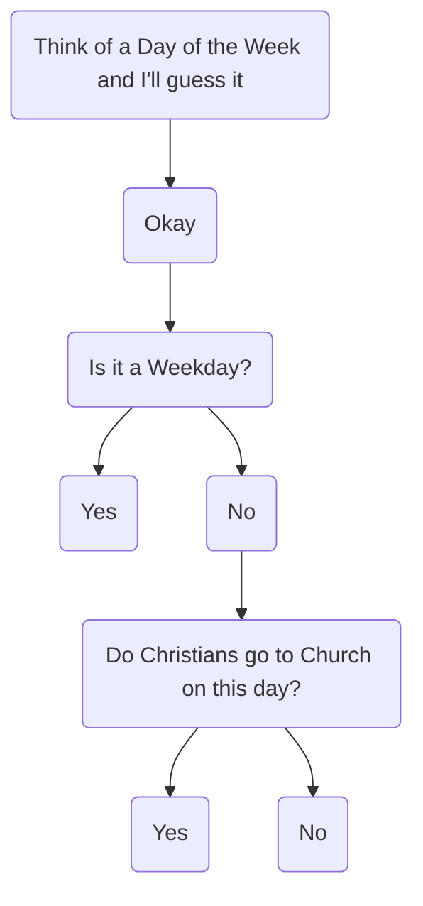

```mermaid
flowchart TD;
    id1(Think of a Day of the Week and I'll guess it) -->id2(Okay);
    id2(Okay)-->id3(Is it a Weekday?);
    id3(Is it a Weekday?)-->id4(Yes);
    id3(Is it a Weekday?)-->id5(No);
    id5(No)-->id6(Do Christians go to Church on this day?);
    id6(Do Christians go to Church on this day?)-->id7(Yes);
    id6(Do Christians go to Church on this day?)-->id8(No);
    
```
